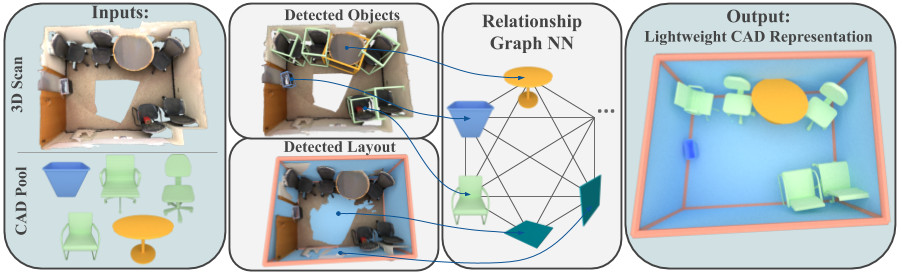
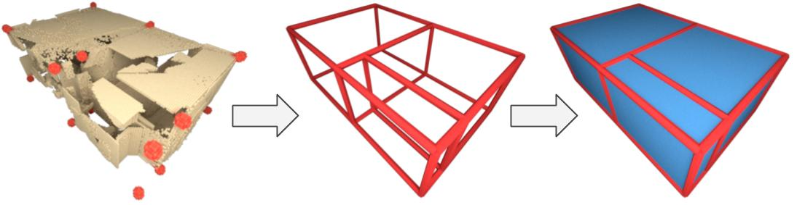

# SceneCAD (ECCV 2020)

We digitize 3D scans by jointly estimating scene layout and predicting CAD model alignments 



 
[Download Paper (.pdf)](https://arxiv.org/abs/2003.12622) 

[See Youtube Video](https://www.youtube.com/watch?v=F0DpggYByh0)


## Description

We introduce a new richly-annotated real-world scene layout dataset con-sisting of 1151 CAD shells and wireframes on top of the ScanNet RGB-Ddataset, allowing large-scale data-driven training for layout estimation.

For the public dataset, we provide annotations with:

* `13756` Corners
* `20509` Edges
* `8376` Planes
* `1151` real-world 3D scans


## Lightweight Layout Prediction Method




## Citation

If you use this dataset or code please cite:

```
@InProceedings{avetisyan2020scenecad,
    title={SceneCAD: Predicting Object Alignments and Layouts in RGB-D Scans},
    author={Armen Avetisyan and Tatiana Khanova and Christopher Choy and Denver Dash and Angela Dai and Matthias Nießner},
    booktitle = {The European Conference on Computer Vision (ECCV)},
    month={August},
    year={2020},
}
```

